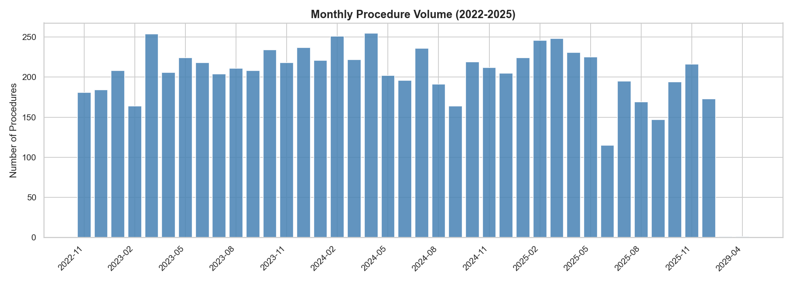
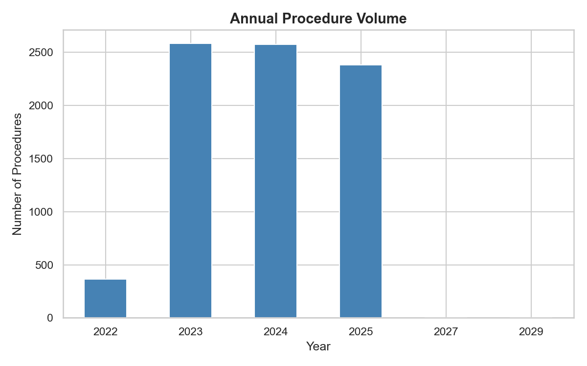
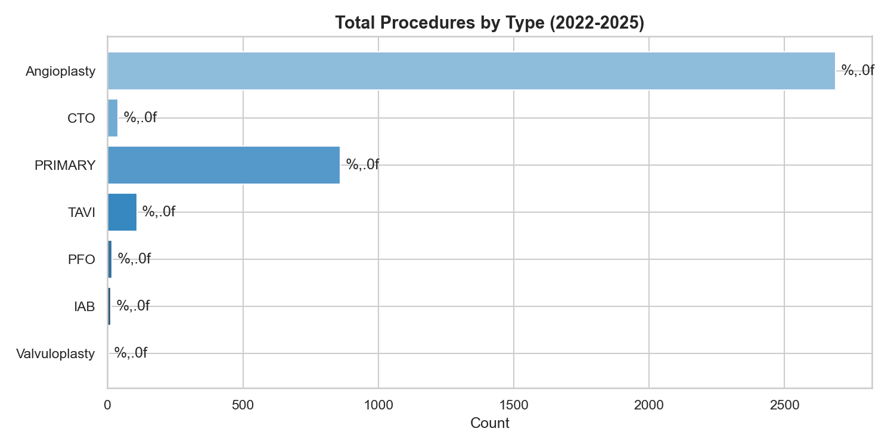
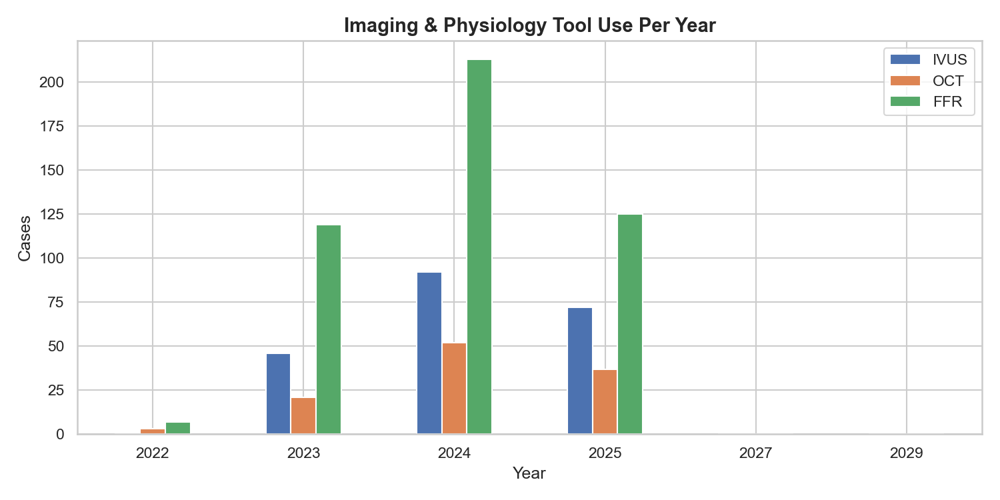
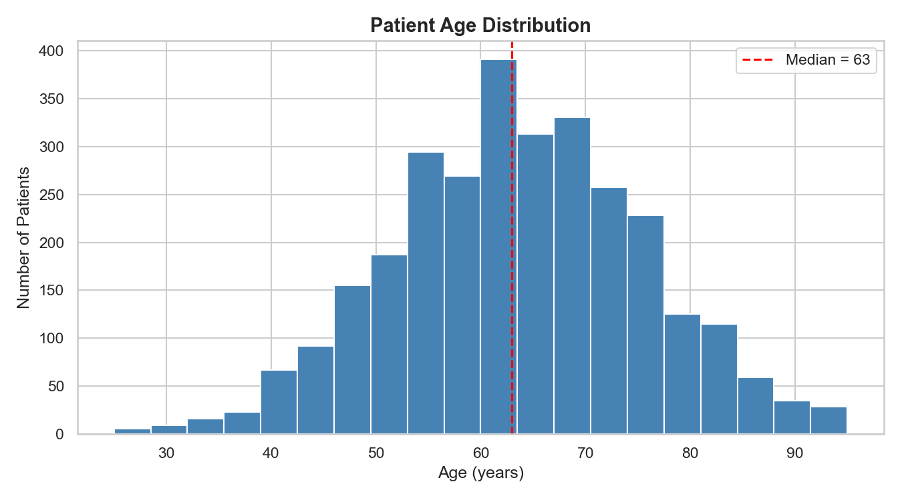
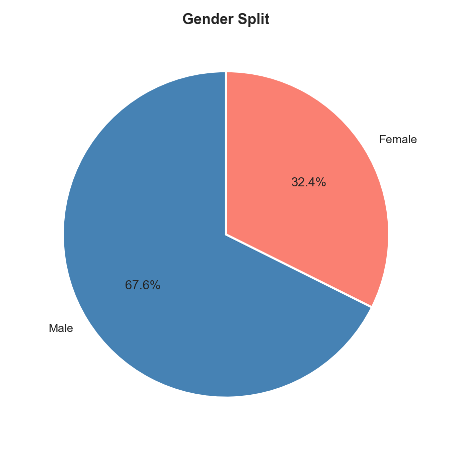
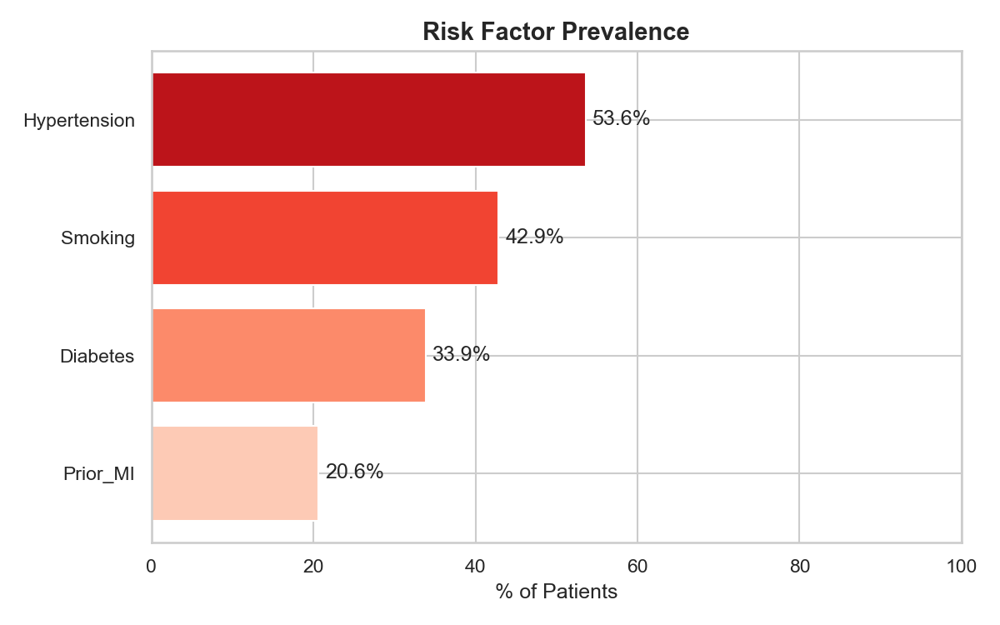
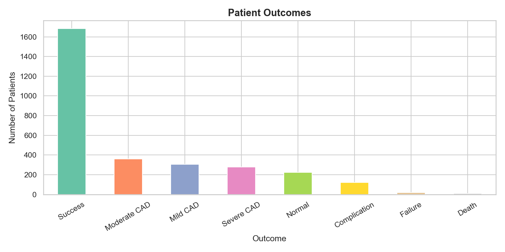
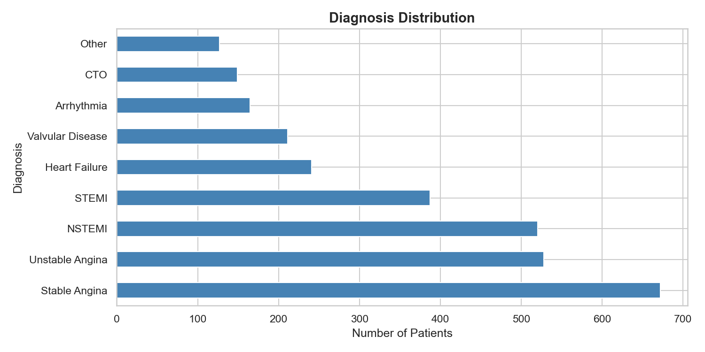
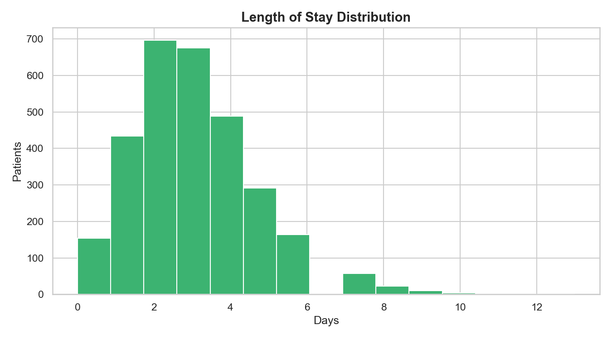

# Cardio-Analytics

**Hospital Catheterisation Laboratory — Medical Data Analysis Portfolio**

A complete data analysis project built on real procedure records from the cardiology catheterisation laboratory (Cath Lab) of a Greek hospital. The dataset covers November 2022 through December 2025 and includes every diagnostic and interventional cardiology procedure performed in the lab.

Built as a portfolio project for a Medical Informatics MSc, demonstrating end-to-end data science skills: raw data cleaning, statistical pattern learning, synthetic data generation, and clinical visualisation.

---

## What This Project Does

| Step | What happened |
|---|---|
| **1. Data completion** | The original hospital Excel file had empty rows for July–December 2025. A Python script learned the statistical patterns from 2024 and generated realistic synthetic data to fill those months — respecting weekends and Greek public holidays. |
| **2. Patient dataset** | Sheet 3 was blank. I generated 3,000 synthetic patient records with clinically realistic distributions for age, gender, BMI, risk factors, diagnoses, procedures, and outcomes. |
| **3. Visualisation** | 10 charts produced from both datasets covering procedure volumes, procedure type mix, advanced imaging tool adoption, patient demographics, risk factors, diagnoses, and clinical outcomes. |

---

## Key Findings

- **Angioplasty rate:** ~37% of diagnostic angiograms led to an intervention
- **STEMI emergency procedures:** ~11% of all interventions — mortality rate 2%, consistent with published literature
- **Advanced imaging adoption:** IVUS and FFR use increased year-on-year, reflecting evolving clinical guidelines
- **Patient profile:** Mean age 64, 68% male, 55% hypertensive, 35% diabetic — typical high-risk cardiology population
- **Procedure success rate:** >92% for elective interventions, >89% for primary PCI (STEMI)

---

## The Charts












---

## How to Run

```bash
pip install pandas numpy matplotlib seaborn openpyxl
python data/generate_data.py
python notebooks/analysis.py

TECHNOLOGIES: Python · pandas · numpy · matplotlib · seaborn · Git · GitHub

Context: Developed as part of a Medical Informatics MSc portfolio. All patient records are entirely synthetic. The procedure log is based on real aggregate hospital data, extended with statistically consistent synthetic data for the second half of 2025.
