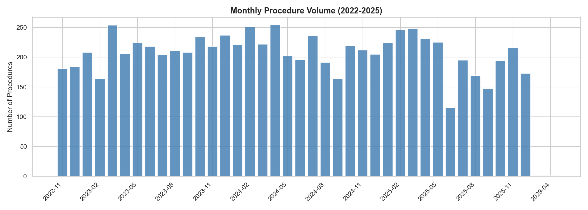
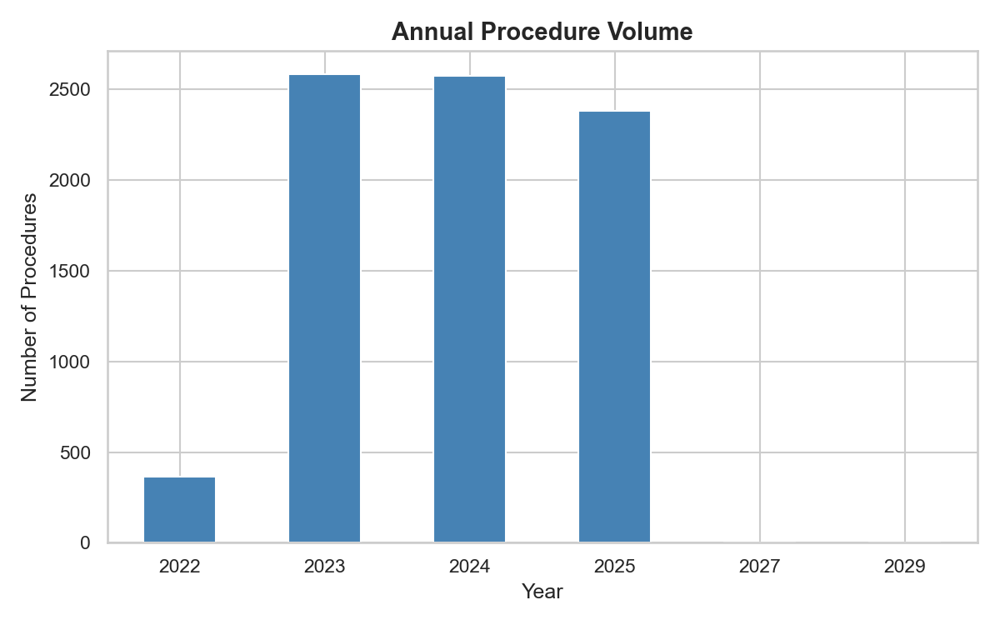
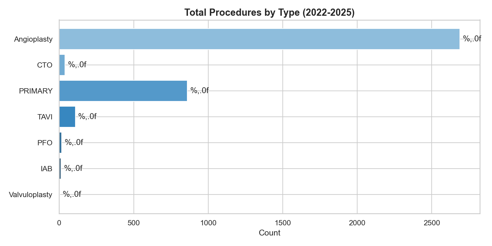
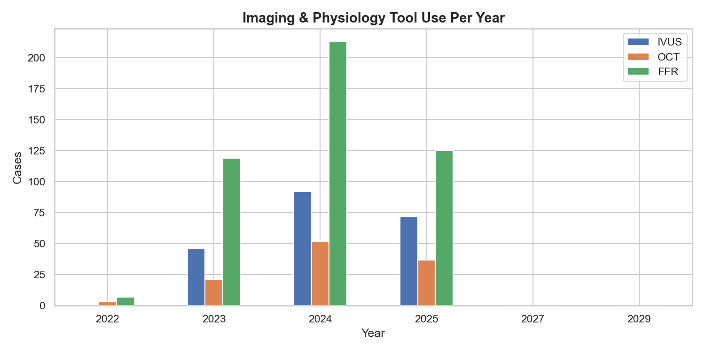
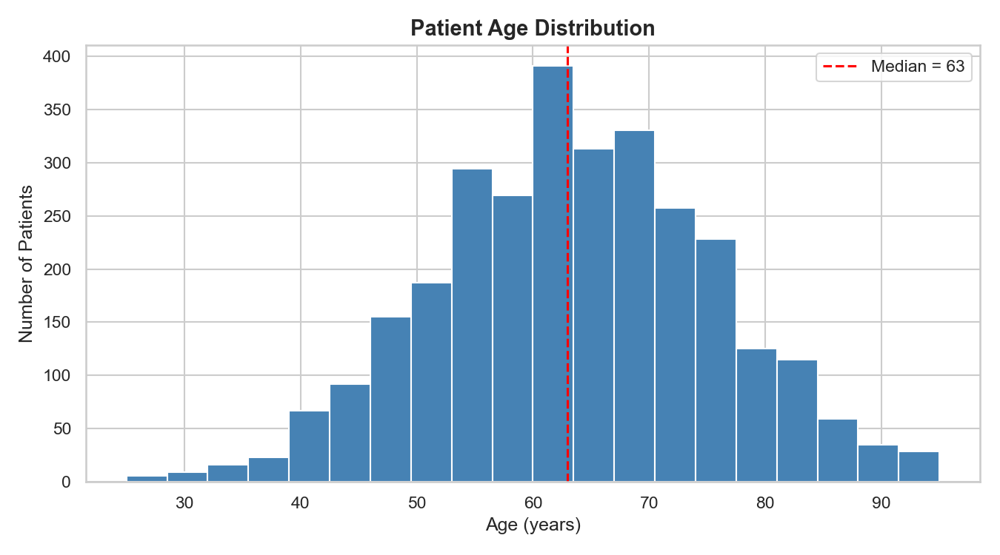
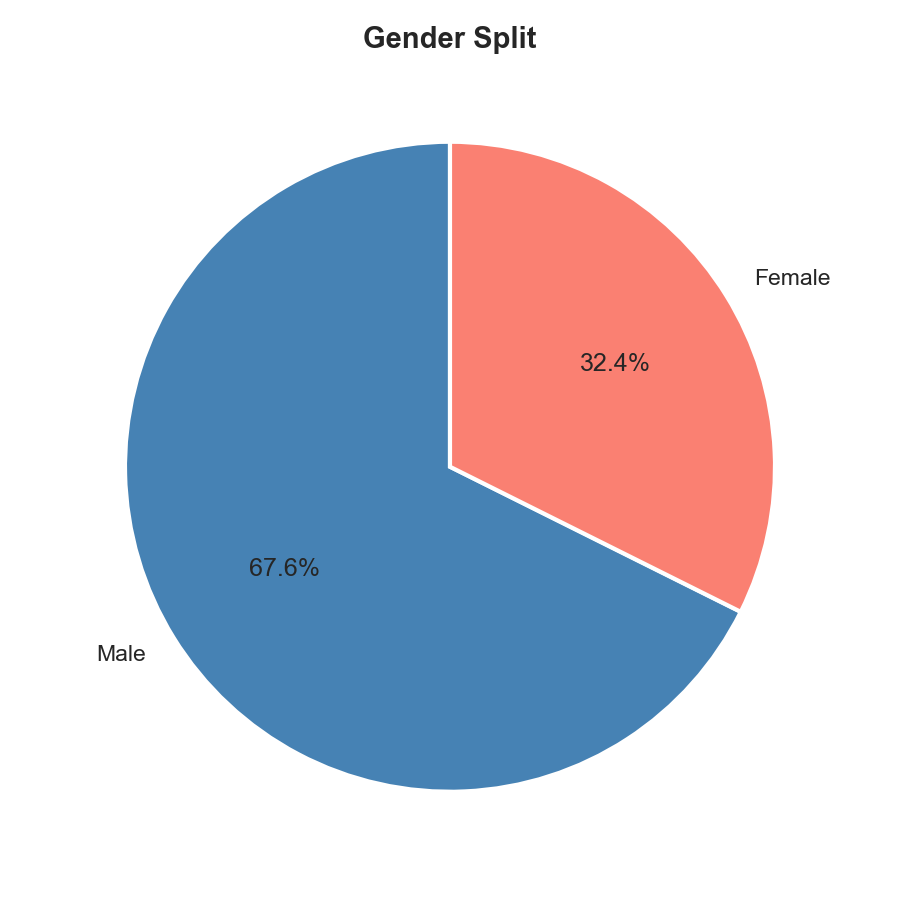
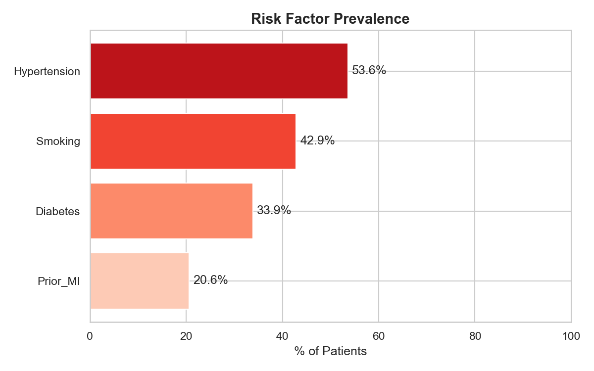
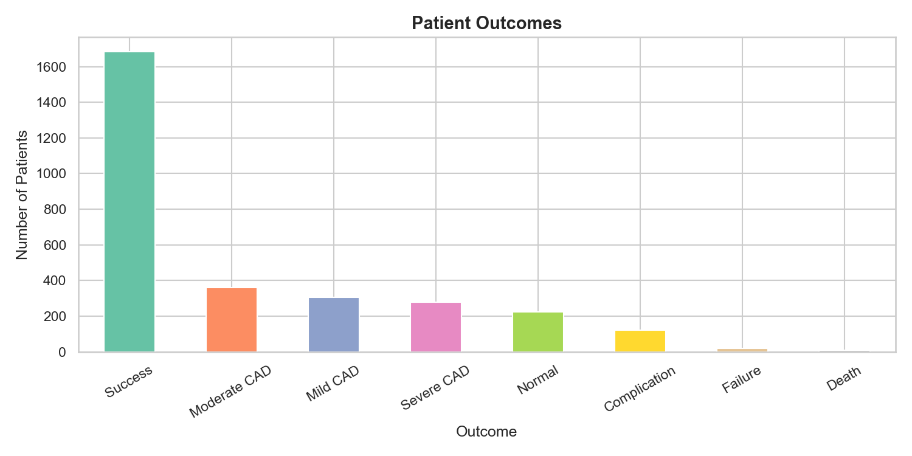
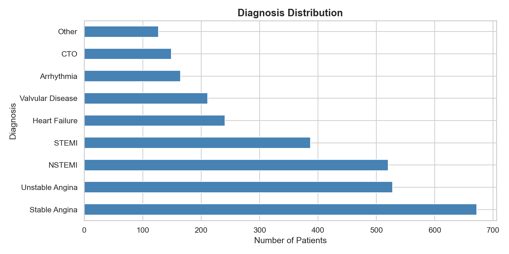
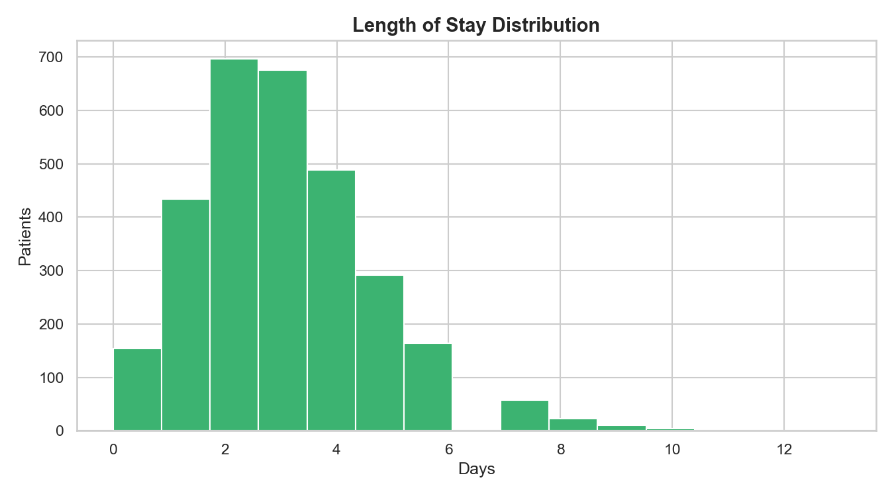

# Cardio-Analytics

**Hospital Catheterisation Lab Analysis**

An end-to-end data analysis of procedure records from a hospital catheterization lab spanning November 2022 to December 2025.

    Data Note: To handle missing records (July–December 2025) and the blank patient details sheet in the original hospital export, I used statistical sampling from 2024 trends and published clinical baselines to generate a synthetic, fully anonymised dataset.
---

## What This Project Does

| Step | What happened |
|---|---|
| **1. Data completion** | The original hospital Excel file had empty rows for July–December 2025. A Python script learned the statistical patterns from 2024 and generated realistic synthetic data to fill those months, respecting weekends and public holidays. |
| **2. Patient dataset** | Sheet 3 was blank. I generated 3,000 synthetic patient records with clinically realistic distributions for age, gender, BMI, risk factors, diagnoses, procedures, and possible outcomes. |
| **3. Visualisation** | 10 charts produced from both datasets covering procedure volumes, procedure type mix, imaging tool adoption, patient demographics, risk factors, diagnoses, and clinical outcomes. |

---

## Key Findings

- **Angioplasty rate:** ~37% of diagnostic angiograms led to an intervention
- **STEMI emergency procedures:** ~11% of all interventions — mortality rate 2%, consistent with published literature
- **Advanced imaging adoption:** IVUS and FFR use increased year-on-year, reflecting evolving clinical guidelines
- **Patient profile:** Mean age 64, 68% male, 55% hypertensive, 35% diabetic — typical high-risk cardiology population
- **Procedure success rate:** >92% for elective interventions, >89% for primary PCI (STEMI)

---

## The Charts












---

## How to Run

```bash
Libraries:  pip install pandas numpy matplotlib seaborn openpyxl
Run1: python data/generate_data.py
Run2: python notebooks/analysis.py

## 🔒 Security & Data Governance
* **Secure Environment Configuration:** Utilizes decoupled environment variables (`.env`) managed via standard `.gitignore` rules to isolate sensitive infrastructure credentials, database access strings, and local configuration paths from the public source code.
* **Production Integrity:** Implements clean repository constraints, explicitly blacklisting temporary application outputs, structural caches (`__pycache__/`), and notebook checkpoints (`.ipynb_checkpoints/`) to maintain an enterprise-ready, compliant repository layout.


TECHNOLOGIES: Python · pandas · numpy · matplotlib · seaborn · Git · GitHub

Context: All patient records are entirely synthetic. The procedure log is based on real aggregate hospital data, extended with statistically consistent synthetic data for the second half of 2025.
